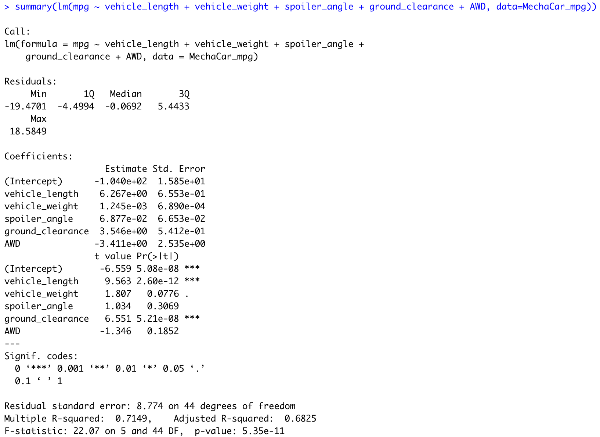
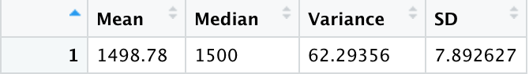
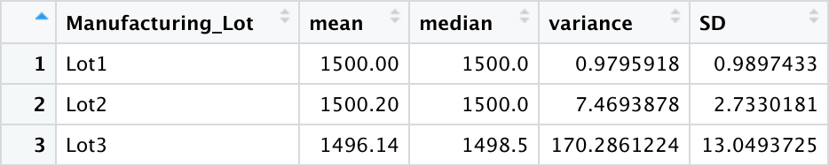
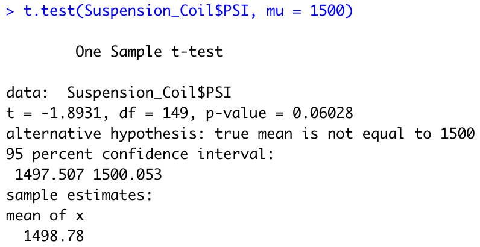
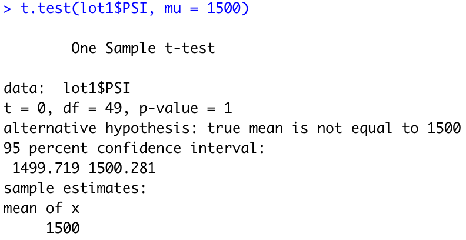
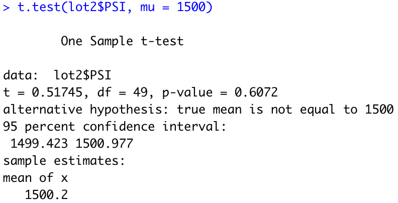
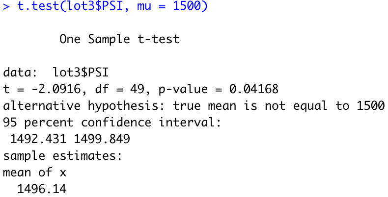

# MechaCar_Statistical_Analysis

## Linear Regression to Predict MPG

- **Q: Which variables/coefficients provided a non-random amount of variance to the mpg values in the dataset?**

    **A:** Vehicle length and ground clearance

- **Q: Is the slope of the linear model considered to be zero? Why or why not?**

    **A:** Yes, because based on the summary result, adjusted R-squared = 0.6825, which means the strength of corralation is moderate, so that the slope of the linear model is considered to be 0.

- **Q: Does this linear model predict mpg of MechaCar prototypes effectively? Why or why not?**

    **A:** Yes, because the p-value is equal to 5.35e-11, which is smaller than 0.05.

## Summary Statistics on Suspension Coils

- **Q: The design specifications for the MechaCar suspension coils dictate that the variance of the suspension coils must not exceed 100 pounds per square inch. Does the current manufacturing data meet this design specification for all manufacturing lots in total and each lot individually? Why or why not?**

    **A:** Based on the sum of total data, the variance of the total sispension coils is 62.29356, which is not exceed 100 pound per square inch.
    
    

    In the lot summary table, we could find that both variance of lot 1 (0.9795918) and lot 2 (7.4693878) are not exceed the standard(100).  However, the variance of lot 3 is 170.2861224, which was exceed and not meet the design specification.

## T-Tests on Suspension Coils

Based on the t-test, p-value of PSI (0.06028) is much different with standard 1, while the meanof PSI (1498.78) is significantly different with the population mean (1500).

Lot 1 and 2 have good condition because their mean is closed to or equal to the population mean (mean of lot 1 = 1500 = population mean, mean of lot 2 = 1500.2 ≈ population mean). Also, their p-values are equal or closed to 1.

However, t-test result for lot 3 shows its mean is significantly different with the population mean.

## Study Design: MechaCar vs Competition

**Write a short description of a statistical study that can quantify how the MechaCar performs against the competition. In your study design, think critically about what metrics would be of interest to a consumer: for a few examples, cost, city or highway fuel efficiency, horse power, maintenance cost, or safety rating.**

**Q: What metric or metrics are you going to test?**
A: cost

**Q: What is the null hypothesis or alternative hypothesis?**

A:
**Ho**: The cost of MechaCar is based on the performance of key factors  correctly.
**Ha**: The cost of MechaCar is not based on the performance of key factors  correctly.

**Q: What statistical test would you use to test the hypothesis? And why?**

A: Multiple linear regression.  Because it could test if the cost have high correlation with the standard (population mean of cost).

**Q: What data is needed to run the statistical test?**
Population mean of cost is needed for comparing purposes.

